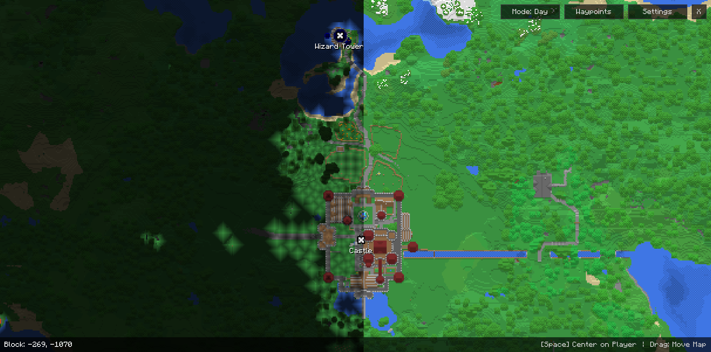
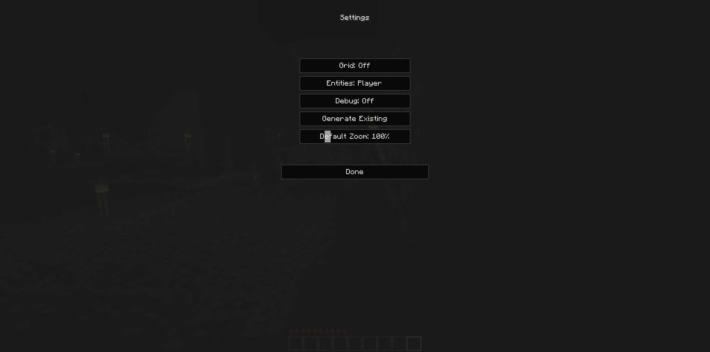
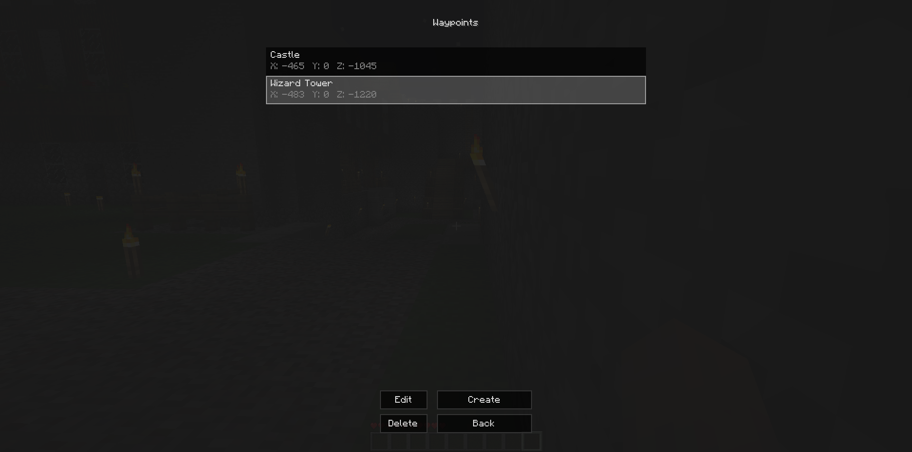
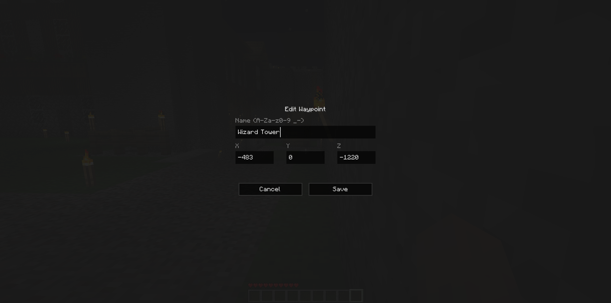

  

A world map mod for **Minecraft Beta 1.7.3**, currently available for both **StAPI** and **ModLoader**.

## 🚧 Early Development Notice
This project is in a very early stage. Designs are experimental, features will change frequently, and instability is expected while work progresses toward version 1.0.

## Requirements

**ModLoader Requirements:**
* [Mod Loader b1.7.3](<https://mcarchive.net/mods/modloader>)

**StAPI Requirements:**
* [Babric Prism/MultiMC Instance](<https://github.com/babric/prism-instance>)
* [StationAPI >=2.0.0-alpha.3](<https://modrinth.com/mod/stationapi>)

**BTA Requirements**
* [BTA Fabric Loader](<https://github.com/Turnip-Labs/fabric-loader/releases>)
* [Halplibe >= 5.3.3](<https://github.com/Turnip-Labs/bta-halplibe/releases/tag/v5.3.3>)

## 📦 Installation
If you already have a Minecraft Beta 1.7.3 instance set up with either **ModLoader** or **StAPI**,
simply download the latest build from the [Releases page](https://github.com/natowb/bm-natosatlas/releases) and place the file into your instance’s `mods` folder.

## 🖼️ Preview

  
  

  
  

